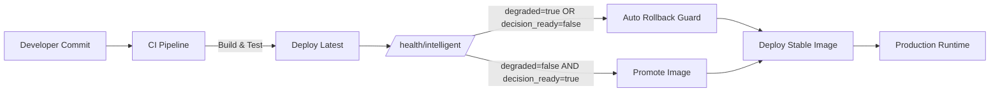

# System Architecture — Self‑Healing CI/CD (Level 2)

## High-Level Flow



---

## Component Responsibilities

### CI Pipeline
- Builds and deploys `latest`
- Acts as **Decision Gate**
- Fail‑Closed by default

---

### Intelligent Health Endpoint
- Single source of truth
- Returns semantic health signals
- Defined by **Health Contract v1**

---

### Auto Rollback Guard
- Enforces deterministic decisions
- Blocks unsafe deployments
- Guarantees idempotent rollback

---

### Image Strategy
- `latest` → evaluation candidate
- `stable` → proven production artifact

Promotion happens **only** after positive health confirmation.
```

---

## 🔹 ASCII Diagram ( README / Review )

```text
Developer
   |
   v
 CI Pipeline
   |
   v
 Deploy (latest)
   |
   v
 /health/intelligent
   |              |
   | bad health   | good health
   v              v
 Rollback      Promote
   |              |
 stable <---------
   |
   v
 Production
```